# Weather to Generation: a Bayesian Model of German Wind and Solar Output

Siddhant Mishra

## Introduction

Germany's grid load and wind/solar generation are published with Day-Ahead forecasts, and weather services publish their own forecasts for temperature, wind speed, and cloud cover. Both forecasts carry error, and neither error is reported against the other: nobody publishes "if you predict generation from weather, and you only have forecast weather instead of actual weather, how much worse does your generation prediction get."

That is the question this report answers. I already had a pipeline (a separate part of the same project, summarized in the accompanying README) that ingests Open-Meteo weather, SMARD/ENTSO-E energy data, and German day-ahead prices, and that scores each forecast against its own actuals. That pipeline showed, among other things, that wind speed correlates with wind generation at r = 0.64 and temperature correlates with solar generation at r = 0.51:

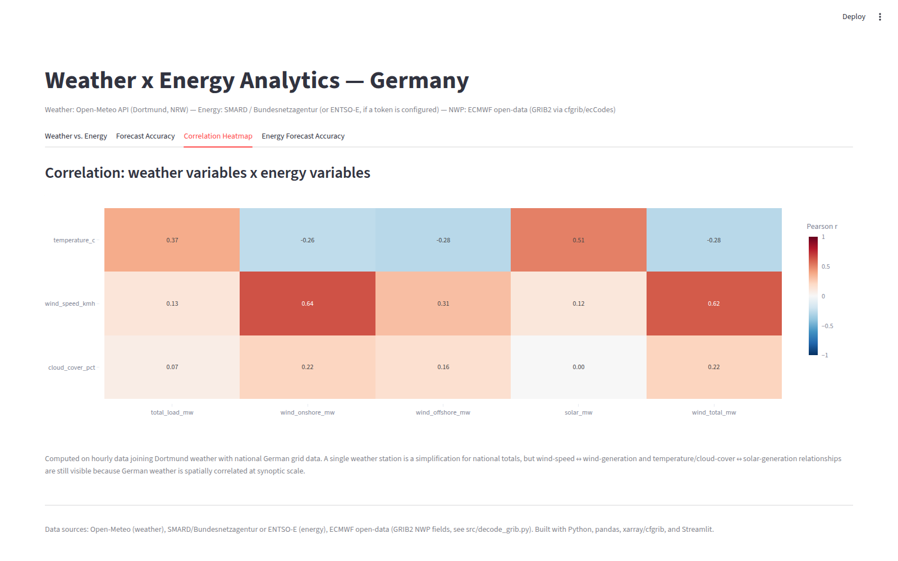

A correlation is not a model, and it says nothing about forecast-driven error. The modeling idea here is direct: fit `wind_onshore_mw ~ wind_speed_kmh` and `solar_mw ~ temperature_c + cloud_cover_pct` as Bayesian regressions, then run every posterior draw through two scenarios: once fed the actual weather used to fit the model (the best this model could ever do), and once fed the forecast weather for the same hours (what a person would actually have on the day). The gap between the two scenarios, taken per draw rather than as two point estimates subtracted from each other, is the accuracy cost attributable specifically to weather forecast error, reported as a distribution rather than a single number.

## Data

Weather comes from the Open-Meteo API for Dortmund, North Rhine-Westphalia: hourly actual (historical/reanalysis-backed) and hourly forecast temperature, wind speed, and cloud cover, over a 90-day window. The forecast series comes specifically from Open-Meteo's Historical Forecast API, which archives each forecast run as it stood at the time it was issued. An earlier version of this pipeline pulled from the plain forecast endpoint's `past_days` parameter instead, which is continuously rewritten with hindsight, and that made the forecast look far more accurate than a real day-ahead forecast would be, and I caught it by checking the raw values against what Open-Meteo actually issues for a past date rather than trusting the endpoint name. Fixing it changed every downstream number in this report.

Energy data is hourly German grid load and wind/solar generation (onshore, offshore, total) from SMARD (Bundesnetzagentur), with an automatic fallback to ENTSO-E if a token is configured. Day-ahead price, also from SMARD/ENTSO-E, is joined in only for the final price-weighted cost figure. A separate script decodes a real ECMWF IFS forecast field (2m temperature) straight from its native GRIB2 format via cfgrib/ecCodes, which is the part of the wider project that specifically exercises NWP binary formats rather than a JSON/REST API:

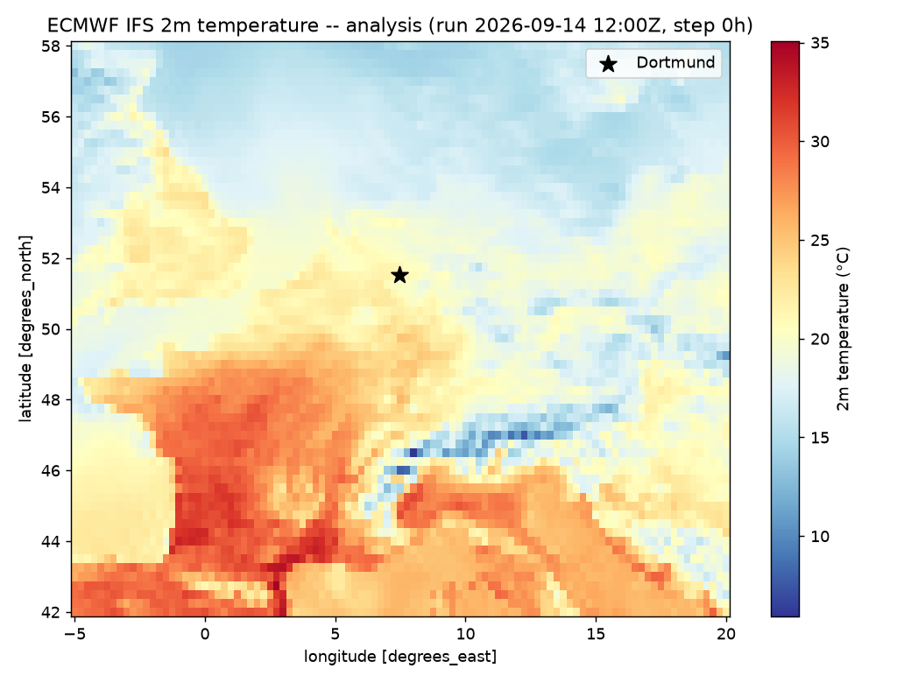

### Previous usage: the dashboard and forecast-bias findings

Before any modeling, the same joined dataset already went through a descriptive pass: a Streamlit dashboard and two hour-of-day bias breakdowns. Both are part of the same project and are what motivated the modeling question above, so I am summarizing their findings here rather than treating the Bayesian model as if it started from nothing.

The dashboard has four views. The first overlays a chosen weather variable against a chosen grid variable over the full window:

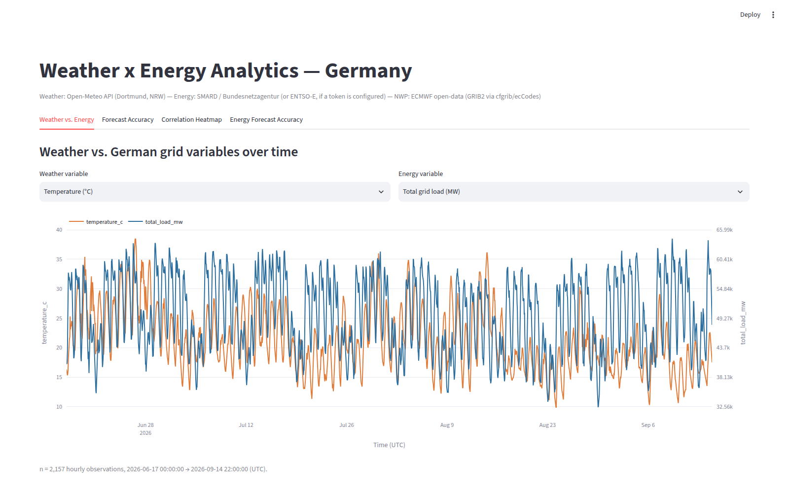

The second plots Open-Meteo's forecast weather against the historical/reanalysis actual, alongside the MAE/RMSE/bias table. This is the view that first showed the forecast running measurably warm:

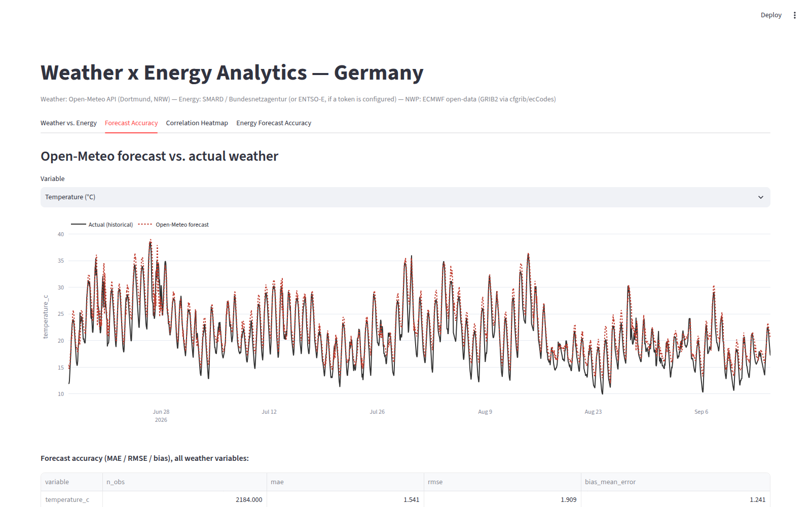

The third is the correlation heatmap already shown in the Introduction, and the fourth applies the same forecast-vs-actual treatment to SMARD/ENTSO-E's own Day-Ahead energy forecasts:

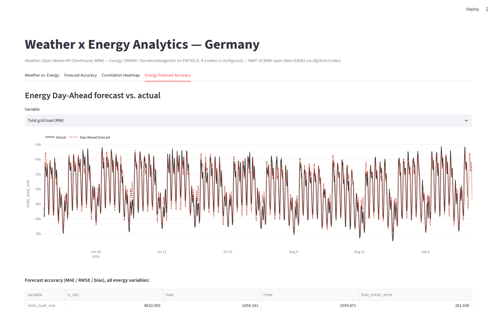

A single MAE/RMSE/bias number per variable, the dashboard's own summary, hides whether error concentrates at particular hours. Two follow-up scripts break that down by hour of day. Temperature forecast bias is positive at every single hour (Open-Meteo runs warm across this entire window, not occasionally), smallest around 09:00-11:00 UTC (+0.05 to +0.11°C) and largest overnight and around dawn, 00:00-04:00 and 20:00-23:00 UTC (+2.0 to +2.3°C), consistent with the forecast underestimating nighttime radiative cooling more than it misjudges daytime peak heating:

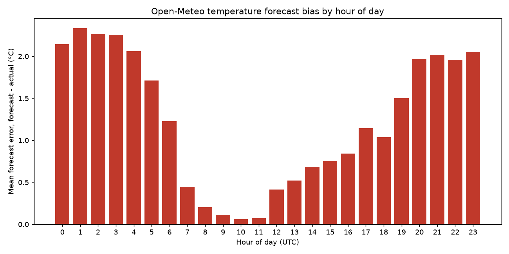

The energy side shows a different, load-specific pattern: Day-Ahead forecasts run low overnight (as much as -890 MW around 01:00 UTC) and high through the daytime ramp (+890 to +944 MW around 08:00-13:00 UTC), wind onshore has its single worst hour at 18:00 UTC (+765 MW, forecast too high), and solar's bias, smaller in absolute MW, is systematically negative through the middle of the day (-134 to -389 MW, 07:00-15:00 UTC):

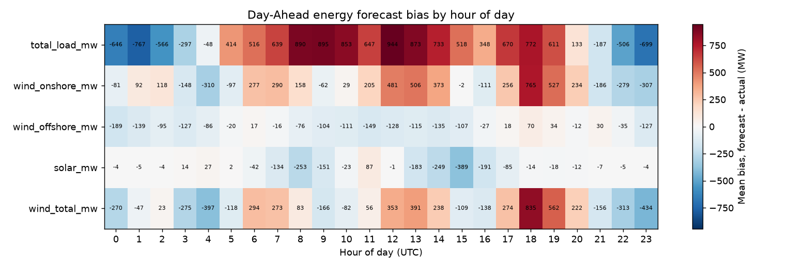

None of this descriptive work says how much the weather forecast's bias costs a generation prediction in MW or EUR. It only shows where the bias sits. That gap is what the Bayesian model below is built to close.

## Models

Two response variables, two different likelihoods, chosen from looking at the data rather than assumed:

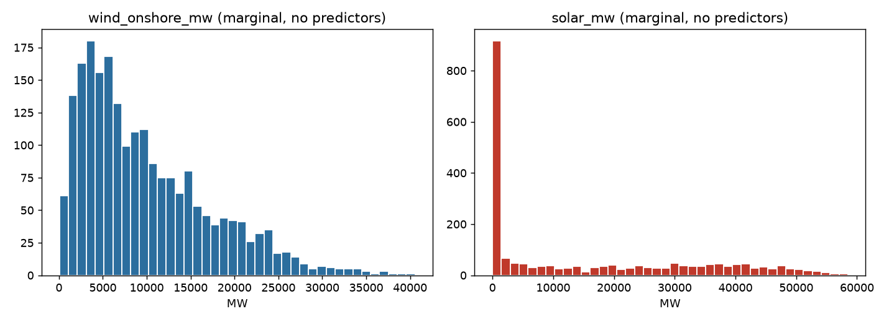

`wind_onshore_mw` never touches zero in this window and is right-skewed, so it gets a **Gamma GLM with a log link**: `wind_onshore_mw ~ Gamma(mean = mu, shape = alpha)`, `log(mu) = b0 + beta * wind_speed_z`. A Normal likelihood on this response can and does place posterior mass below zero MW, which cannot happen physically; Gamma respects the positive support by construction.

`solar_mw` is a two-part shape: a large spike at exactly 0 MW (nighttime hours, when solar output is zero by definition, not by measurement noise) plus a separate right-skewed process for daylight hours. That gets a **hurdle-Gamma**: a Bernoulli gate for zero-versus-nonzero, `P(nonzero) = invlogit(g0 + gamma_beta . X)`, times a Gamma for the positive part conditional on being nonzero, `mean(y | y>0) = exp(b0 + beta . X)`. This is a hurdle model, not zero-inflation: a continuous Gamma already assigns exactly zero probability to the single point y = 0, so every nighttime zero has to come from the gate, not from the Gamma itself. PyMC/brms does not ship a built-in `hurdle_gamma` family the way Stan/brms does, so I implemented it as a `pm.CustomDist` with a hand-written `logp` (switching between `log1p(-p)` at y = 0 and `log(p) + Gamma.logp(y)` at y > 0), verified by checking that its prior predictive draws reproduce roughly the right fraction of exact zeros before trusting it on real data.

Both models use the same predictors as in the correlation stage above, standardized (z-scored) before fitting; the response stays on its natural MW scale throughout, since the log link already keeps the mean positive and Gamma/hurdle-Gamma are not defined on a z-scored, potentially negative response.

## Priors

Every prior below is an explicit, proper distribution chosen with the response's actual scale in mind. None of them are PyMC's defaults, and none are flat.

- **Intercepts** (`b0` for wind, `b0` and `g0` for solar): `Normal(mu, sigma=1.0)`, with `mu` set to `log(mean(y))` for the Gamma-mean intercepts (`b0`) and to `0` for the Bernoulli-gate intercept (`g0`, since the logit scale has no obvious empirical center the way a log-MW scale does). A naive `Normal(0, 1)` intercept would center the prior mean generation near `exp(0) = 1` MW, nowhere close to the actual scale of several thousand MW, so the prior is explicitly re-centered at the log of each response's own mean before the model ever sees the full likelihood.
- **Slopes** (`beta`, `gamma_beta`): `Normal(0, 1)` on the standardized predictors. Scale-free by construction, since the predictors are already z-scored, so a fixed unit-scale prior means the same thing (a plausible-sized effect per one standard deviation of the predictor) for every coefficient in both models.
- **Gamma shape** (`alpha`, shared by the wind model and the positive part of the solar model): `Gamma(alpha=2.0, beta=0.1)`, mean 20. A diffuse `Gamma(0.01, 0.01)` prior, a common textbook default for this parameter, puts substantial prior mass near shape ≈ 0, which is a pathological, near-degenerate corner of Gamma noise; `Gamma(2, 0.1)` was chosen specifically to avoid that region while still being weakly informative.

## Code

The full notebook, `notebooks/generation_model.ipynb`, and the rest of the project (ingest scripts, the join/scoring script, the dashboard) are in the accompanying repository. The two model-building functions are `build_wind_gamma_model` and `build_solar_hurdle_model`; both take a standardized design matrix and an optional `y` (omitting `y` builds the same graph unconditioned, for the prior predictive check).

```python
def build_wind_gamma_model(Xz: np.ndarray, y=None) -> pm.Model:
    with pm.Model(coords={"predictor": wind_x_cols}) as model:
        b0 = pm.Normal("b0", mu=WIND_B0_PRIOR_MU, sigma=1.0)
        beta = pm.Normal("beta", mu=0, sigma=1, dims="predictor")
        alpha = pm.Gamma("alpha", alpha=SHAPE_PRIOR_ALPHA, beta=SHAPE_PRIOR_BETA)
        mu = pm.Deterministic("mu", pm.math.exp(b0 + pm.math.dot(Xz, beta)))
        if y is None:
            pm.Gamma("y_obs", alpha=alpha, beta=alpha / mu, shape=Xz.shape[0])
        else:
            pm.Gamma("y_obs", alpha=alpha, beta=alpha / mu, observed=y)
    return model
```

```python
def hurdle_gamma_logp(value, p, mu, alpha):
    safe_value = pt.switch(pt.eq(value, 0), 1.0, value)
    gamma_lp = pm.logp(pm.Gamma.dist(alpha=alpha, beta=alpha / mu), safe_value)
    return pt.switch(pt.eq(value, 0), pt.log1p(-p), pt.log(p) + gamma_lp)
```

Explicit parameter choices for sampling: **2 chains**, **500 tuning steps**, **500 draws** per chain (1,000 post-warmup draws total per model), `target_accept = 0.9`, fixed random seed 42. `target_accept = 0.9` (above PyMC's default of 0.8) was set deliberately, since a Gamma likelihood with a log link is more prone to divergences than a Normal likelihood, and a higher target acceptance rate reduces step size in exactly the regions where that would otherwise happen. The chain/tune/draw counts are lower than PyMC's own default (4 chains, 1,000 plus 1,000), a deliberate speed-for-precision trade explained under Limitations below.

## Convergence diagnostics

R-hat and effective sample size (ESS), both bulk and tail, checked on every sampled parameter:

| Model | Parameter | R-hat | ESS (bulk) | ESS (tail) |
|---|---|---|---|---|
| wind (Gamma) | b0 | 1.00 | 863 | 694 |
| wind (Gamma) | beta (wind_speed_kmh) | 1.00 | 867 | 764 |
| wind (Gamma) | alpha | 1.00 | 1,126 | 762 |
| solar (hurdle-Gamma) | g0 | 1.01 | 1,137 | 742 |
| solar (hurdle-Gamma) | gamma_beta (temperature_c) | 1.00 | 1,299 | 698 |
| solar (hurdle-Gamma) | gamma_beta (cloud_cover_pct) | 1.00 | 1,304 | 411 |
| solar (hurdle-Gamma) | b0 | 1.00 | 1,337 | 631 |
| solar (hurdle-Gamma) | beta (temperature_c) | 1.00 | 1,160 | 651 |
| solar (hurdle-Gamma) | beta (cloud_cover_pct) | 1.00 | 1,600 | 875 |
| solar (hurdle-Gamma) | alpha | 1.01 | 1,179 | 575 |

Every parameter clears the ESS(bulk) ≥ 400 threshold, and there were 0 divergent transitions across both models. Two solar parameters, `g0` and `alpha`, come in at R-hat = 1.01 rather than the stricter 1.00 the notebook's own pass/fail check requires (within 0.01 of 1.00), which is why that automated check reports `False` even though nothing here looks badly broken. Trace plots for both models (`generation_model_trace_wind.png`, `generation_model_trace_solar.png`) show the chains mixing as overlapping, structureless bands with no visible drift, consistent with the R-hat/ESS numbers rather than contradicting them. The two borderline parameters are exactly the ones I would sample longer first if I re-ran this with more compute, per the Limitations section below.

## Model comparison

Two qualitatively different likelihood families are fit for each target and compared with PSIS-LOO (Pareto-smoothed importance-sampling leave-one-out cross-validation), via `az.compare`: the model used in this report (Gamma for wind, hurdle-Gamma for solar) against a Normal-likelihood baseline with otherwise-identical predictors. The baseline is not diagnosed on its own merits; it exists specifically to be discredited by this comparison, since the marginal-distribution EDA above already shows why a Normal likelihood is the wrong choice for either target.

| Target | Model | Rank | elpd_loo | p_loo | elpd_diff | SE | Weight |
|---|---|---|---|---|---|---|---|
| wind | gamma | 0 | -21,426.1 | 2.86 | 0.0 | 37.3 | 0.898 |
| wind | normal_baseline | 1 | -21,699.0 | 3.18 | 272.9 | 34.9 | 0.102 |
| solar | hurdle_gamma | 0 | -17,832.7 | 5.83 | 0.0 | 217.0 | 0.804 |
| solar | normal_baseline | 1 | -23,839.7 | 3.56 | 6,006.9 | 26.1 | 0.196 |

Both correctly-specified models beat their Normal baseline, and the margin is informative on its own: the ELPD difference for solar (6,007, against a standard error of 26.1 for the baseline's own SE) is over twenty times larger than wind's (273, SE 34.9). That gap size tracks the EDA directly: solar's two-part, exact-zero-plus-right-skew shape is a far worse fit for a Normal density than wind's simpler right skew, so the predictive cost of getting the likelihood wrong is correspondingly larger for solar.

### Prior predictive check

Before either model saw the data, I simulated from the prior alone and compared the simulated range to the observed data's range:

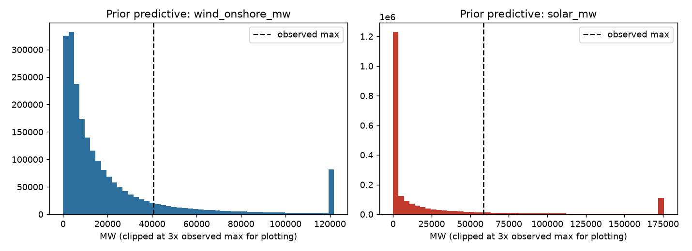

The bulk of the prior predictive mass sits below the observed maximum for both targets, with a longer tail extending past it (and a small clipped spike at the plotting cutoff, from the Gamma's heavy right tail under this shape prior) rather than concentrating on implausible values by default. That is what a weakly informative prior should look like here: it does not rule out large generation values, but it also does not put most of its mass somewhere physically absurd before any data is seen.

### Posterior predictive check

After fitting, I drew from each model's posterior predictive distribution and compared it back to the actual observed values, in original MW units:

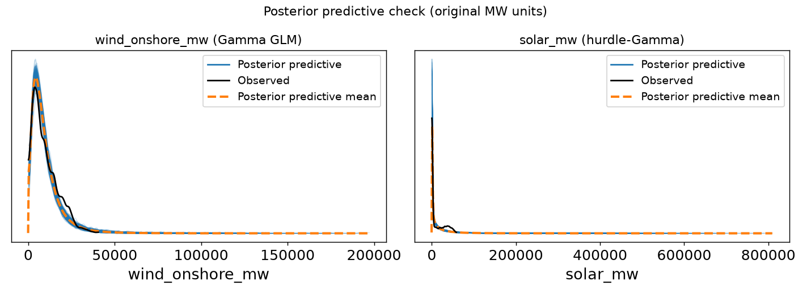

Both models track the bulk of their target's distribution. The remaining misfit is concentrated exactly where the model is structurally simple: a one-predictor Gamma GLM cannot capture every feature of a right-skewed wind distribution with a single shape parameter, and solar's hurdle gate, driven by only two weather covariates, does not perfectly reproduce the exact split between zero and nonzero hours. Neither model needed re-iteration beyond this point. The PSIS-LOO comparison above already confirmed each is a large improvement over the alternative I would otherwise have shipped, and the remaining misfit is a known consequence of using one or two predictors rather than a reason to change the likelihood family again.

### Predictive performance

The best-case-versus-forecast-driven evaluation is the actual point of this report. Every posterior draw predicts twice, once on the actual weather used to fit the model and once on Open-Meteo's forecast weather for the same hours, and the MAE gap between the two is reported as a full posterior distribution:

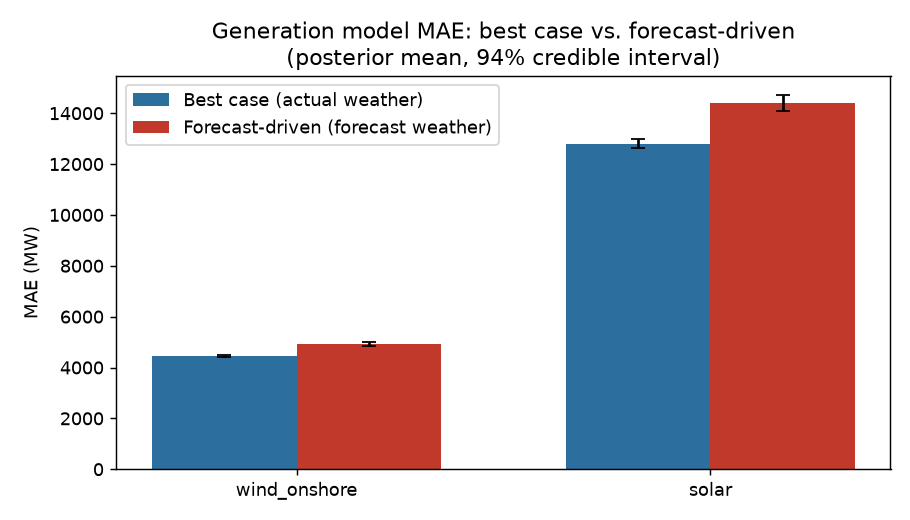

The forecast-driven accuracy cost comes out to **+456 MW (94% CI: 414, 500)** for wind and **+1,587 MW (94% CI: 1,317, 1,882)** for solar. Solar's gap is roughly three and a half times wind's, and wider in absolute credible-interval terms too, consistent with its hurdle structure having two separate linear predictors (the gate and the positive-part mean) that can each be thrown off by imperfect forecast weather, against wind's single linear predictor. Price-weighted against the actual hourly day-ahead price over the ~2,100 priced hours in this window, this comes out to an illustrative imbalance-equivalent cost of EUR 1.21 billion for wind and EUR 3.74 billion for solar, explicitly **not** a real settlement estimate, since real imbalance settlement prices signed error against a dedicated imbalance price rather than absolute error against the day-ahead price, but a EUR-scale sense of how much this window's forecast error is worth at real German price levels.

## Limitations and potential improvements

- **MCMC settings were reduced from PyMC's own default** (2 chains x 500 tune + 500 draws, instead of 4 x 1,000 + 1,000) for runtime reasons on this machine, which is also constrained to PyTensor's pure-Python linker rather than its compiled C backend (a separate, unrelated environment issue). This is the direct cause of the two R-hat = 1.01 parameters above; running with the full default settings would very likely resolve both.
- **A single weather station (Dortmund) stands in for nationwide generation totals.** The physical relationship still shows up at national scale, since German synoptic weather is spatially correlated over hundreds of kilometers, but a production version of this model would use a generation-weighted spatial average across German wind and solar sites instead.
- **Each model uses one or two predictors.** Wind generation depends on more than wind speed alone (air density, turbine-level wake effects, curtailment), and solar depends on irradiance more directly than on temperature and cloud cover, which are proxies for it. Adding predictors is a natural next step, and the posterior predictive check above already shows where the current, simpler models fall short.
- **The hurdle-Gamma is implemented by hand** (`pm.CustomDist` with a manually written `logp`), since PyMC does not ship a built-in `HurdleGamma` family the way Stan/brms does. I checked its prior predictive draws against the expected zero/nonzero fraction before trusting it, but a from-scratch log-density is inherently more error-prone than a library-provided one, and is worth re-deriving from first principles again if this model is extended.
- **The price-weighted cost is explicitly illustrative**, not a real settlement or trading estimate: real imbalance settlement uses signed forecast error against a dedicated imbalance/balancing price for each settlement period, not absolute error against the day-ahead price used here.
- **The 90-day data window** keeps the pipeline fast and within free-tier API limits, but it also means the credible intervals above reflect one season's worth of weather-generation relationship, not a year-round one; solar in particular would look different fit against a full annual cycle.

## Conclusion

Weather forecast error has a real, quantifiable cost for predicting German renewable generation, and that cost is not the same for wind and solar. Using a Gamma GLM for wind and a hurdle-Gamma for solar, chosen from the data's own marginal shape rather than assumed, and evaluating each model's posterior on both actual and forecast weather, the forecast-driven accuracy cost comes out to +456 MW for wind and +1,587 MW for solar, both as 94%-credible-interval distributions rather than single numbers. PSIS-LOO confirms both likelihood choices are a substantial improvement over a Normal baseline, more so for solar than for wind, in line with how much more badly a Normal density misrepresents solar's two-part distribution. Price-weighted against real day-ahead prices, this translates to a EUR-billion-scale illustrative cost over a single 90-day window. That is a reminder that the size of a forecast-accuracy problem, in MW, does not translate one-to-one into its size in EUR, since price level and volatility matter as much as the MW gap itself.

## Reflection on own learning

The single biggest change in how I approached this project, relative to how I'd have approached it before, was ordering EDA before likelihood choice rather than the other way around. My first version of this model used a plain Normal likelihood on standardized data, because that is the default most linear-regression workflows reach for without thinking about it. It was only after looking at the histograms of `wind_onshore_mw` and `solar_mw`, not just their summary statistics, that I saw the Normal assumption was wrong for both, in two different ways. That reordering (EDA, then likelihood, then priors, then prior predictive check, then fit) is now the thing I'd insist on for any future regression project, Bayesian or not.

The forecast-source bug in the weather ingest was the other significant lesson, and it wasn't a modeling lesson at all; it was a data-provenance one. Open-Meteo's plain forecast endpoint's `past_days` parameter looks, from its name and its shape, exactly like an archived forecast. It isn't: it's continuously rewritten with hindsight, so every number downstream of it (correlation, forecast bias, and every figure in this report) looked artificially good until I checked the endpoint's behavior against a specific known date rather than trusting the parameter name. That changed my default level of trust in any "forecast" field I haven't personally verified is frozen at issue time.

Implementing the hurdle-Gamma by hand, rather than reaching for a library that already has one, forced me to actually understand what a hurdle model is doing at the log-likelihood level (the `log1p(-p)` versus `log(p) + Gamma.logp(y)` switch), instead of treating "hurdle model" as a name I could cite without being able to derive. I'd rather have that understanding stick from having built it once manually than from having called `brms::hurdle_gamma()` and trusted it worked.
